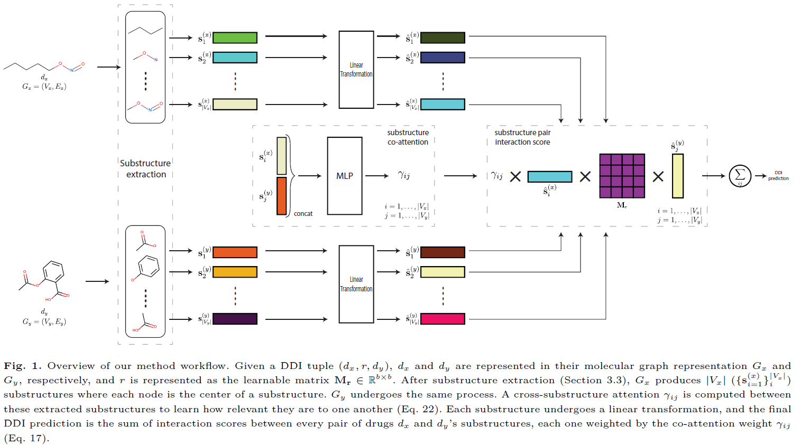

# GMPNN-CS
Source code for ["Drug-drug Interaction Prediction with Learnable Size-Adaptive Molecular Substructures"]() 
   
  

 ## Required packages
* Python == 3.7
* [PyTorch](https://pytorch.org/) == 1.6
* [PyTorch Geometry](https://pytorch-geometric.readthedocs.io/) == 1.6
* [rdkit](https://www.rdkit.org/) == 2020.09.1 (for data preprocessing)

## Dataset
### Download
Datasets can be downloaded using the python library [Therapeutics Data Commons](https://tdcommons.ai/).

### Data Preprocessing
Molecular graph representation and negative samples generation. All saved in [data/preprocessed](data/preprocessed).   

    python data_preprocessing.py -d {drugbank,twosides} [-n NEG_ENT] [-s SEED] -o {all,generate_triplets,drug_data,split} [-t_r TEST_RATIO] [-n_f N_FOLDS]

Arguments:

    -d  Dataset to be preprocessed. Choose from {drugbank, twosides}.
    -n Number of negative samples per positive sample. Default=1
    -s Seed for the random number generator. Default=0
    -o Preprocessing operation to perform. Choose from {all, generate_triplets, drug_data, split}.
        1. generate_triplets: generates triplets + negative samples.
        2. drug_data: transform drugs to graphs.
        3. split: stratified splitting of the dataset in -n_f number of folds.
        4. all: does all the above at once.
    -t_r test set ratio [0-1]. Default=0.2
    -n_f number of folds. Default=3
## Training 
    python train_on_fold.py -d {drugbank, twosides} -fold FOLD -n_iter N_ITER [-drop DROPOUT] [-b BATCH_SIZE]

Arguments:

    -d  Dataset to be trained on. Choose from {drugbank, twosides}.
    -fold fold of the dataset to be trained on.
    -n_iter Number of iterations for message passing.
    -drop dropout probability in [0-1]. Default=0.
    -b Batch size of DDI triplets. Default=512.